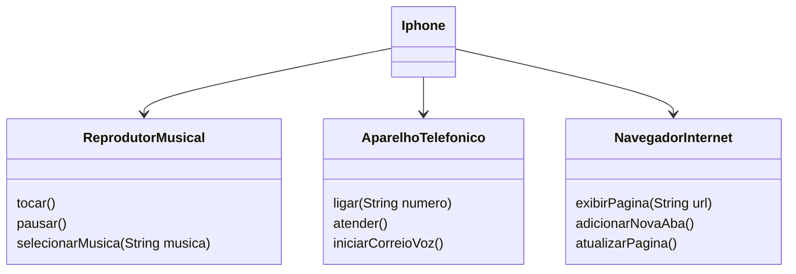

# Diagrama-de-classes-Iphone
projeto do bootcamp Java Cloud Native

```mermaid
classDiagram

    class AparelhoTelefonico {
	    ligar(String numero)
	    atender()
        iniciarCorreioVoz()
    }

    class NavegadorInternet {
	    exibirPagina(String url)
	    adicionarNovaAba()
        atualizarPagina()
    }

    class Iphone {
    }

    class ReprodutorMusical {
	    tocar()
	    pausar()
	    selecionarMusica(String musica)
    }

	Iphone

    Iphone --> ReprodutorMusical
    Iphone --> AparelhoTelefonico
    Iphone --> NavegadorInternet

```
